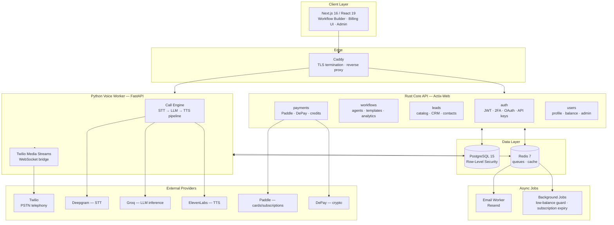
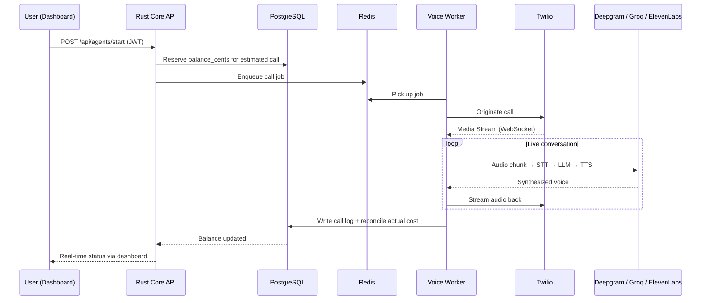
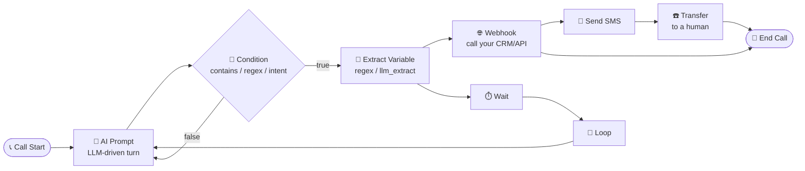

# 🎙️ LeadHunterOS

### The self-hosted, visual-workflow platform for AI voice agents that call, qualify, and book leads for you

**Build an autonomous AI sales rep once. Run thousands of parallel outbound & inbound calls through your own Twilio number, with a drag-and-drop conversation builder, real-time lead marketplace, and usage-based billing built in.**

[Live demo](https://leadhunteros.com) · [Features](#-key-features) · [Architecture](#-architecture) · [Workflow Nodes](#-visual-workflow-builder) · [Pricing](#-pricing) · [How LeadHunterOS compares](#-how-leadhunteros-compares)

---

## What is LeadHunterOS?

**LeadHunterOS** is a multi-tenant SaaS platform for building, deploying, and monetizing **AI voice agents** — autonomous callers that hold real phone conversations over Twilio, qualify leads, extract structured data, book meetings, send follow-up SMS, and hand off to a human when needed.

Instead of writing prompt-engineering spaghetti or gluing together five different vendor APIs, you design the agent's entire conversation logic as a **visual node graph** (powered by [`@xyflow/react`](https://reactflow.dev/)) — branches, conditions, webhooks, variable extraction, loops, transfers — and LeadHunterOS compiles it into a live, low-latency phone agent running on a Deepgram → Groq LLM → ElevenLabs voice pipeline.

On top of that, it ships with everything a voice-AI product actually needs to be a *business*, not just a demo:

- A **credit-based billing engine** with Paddle subscriptions and crypto payments (DePay)
- A **public lead marketplace** for buying/selling qualified leads
- **Row-Level-Security multi-tenancy** at the PostgreSQL level (not just at the app layer)
- A full **admin back-office** for support, refunds, and manual credit adjustments
- A **template marketplace** ("Workshop") where users publish and sell reusable agent flows

---

## ✨ Key Features

| | |
|---|---|
| 🧩 **Visual Workflow Builder** | Drag-and-drop node canvas (React Flow) with 11 node types covering prompts, conditions, webhooks, variable extraction, loops, transfers, SMS, and more |
| 📞 **Real Telephony, Not a Demo** | Native Twilio inbound/outbound integration with signed webhook verification, test-call trigger, and per-workflow publish/unpublish lifecycle |
| 🗣️ **Multi-language Voice** | Native STT/TTS locale support for `en-US`, `uk-UA`, `pl-PL`, and `es-ES`, modeled as a first-class Postgres enum, not a loose string |
| 🛒 **Built-in Lead Marketplace** | A public catalog of leads alongside a private per-tenant CRM (contacts, intel, lifecycle) — buy leads with in-app credits, no separate checkout flow |
| 💳 **Dual Payment Rails** | Card payments & subscriptions via **Paddle** (with server-side price computation — the client never controls the charge amount) *and* crypto payments via **DePay**, both reconciled into a single `balance_cents` ledger |
| 🔐 **Real Multi-Tenancy** | Tenant isolation enforced with PostgreSQL **Row-Level Security**, a dedicated `TenantConn` for user-scoped queries, and a `ServicePool` with `BYPASSRLS` reserved strictly for webhooks/admin/system jobs |
| 🧾 **Usage-Based Billing** | Per-minute call costing reserved at call-start and reconciled at call-end, tiered plans with bundled monthly credits, daily/concurrency caps enforced server-side |
| 🛡️ **Security-First Auth** | Email/password with bcrypt, mandatory 2FA (email code + pre-auth token flow), Google OAuth, JWT sessions, and scoped API keys for machine-to-machine access |
| 📊 **Admin Dashboard** | Platform-wide stats, user list, and manual credit top-ups, guarded by a dedicated `AdminClaims` type — not just a route prefix |
| 🧠 **Agent Analytics** | Per-agent call analytics and usage stats surfaced straight in the dashboard |
| 🔔 **Async Notification Pipeline** | Dedicated Redis-queued email worker + low-balance guard + subscription-expiry background jobs, decoupled from the request/response path |
| 🐳 **Production-Grade Ops** | Docker Swarm-style rolling deploys (`start-first`, automatic rollback on failure), health checks on every service, Caddy as the TLS-terminating reverse proxy |

---

## 🏗️ Architecture

LeadHunterOS is a **polyglot micro-service system**: a Rust API for anything transactional (auth, billing, workflow CRUD, leads), and a separate Python worker dedicated to the latency-sensitive job of actually running a live phone call.

**Why two backends instead of one?** A voice call is a long-lived, latency-critical WebSocket session (audio in, audio out, sub-second turnaround) — a completely different runtime profile from a REST API doing CRUD and billing math. Splitting them means the Rust core can stay fast and simple for transactional work, while the Python worker can be scaled and restarted independently (`stop_grace_period: 15m` in production, so in-flight calls are never dropped mid-conversation).

### Request lifecycle for an outbound call

---

## 🧩 Visual Workflow Builder

Every agent is a graph of nodes. No YAML, no prompt spaghetti — you wire logic visually and LeadHunterOS validates the graph server-side (via Rust `validators`) before it can ever go live.

| Node | Purpose |
|---|---|
| **AI Prompt** | An LLM-driven conversational turn — the core building block of every agent |
| **API Trigger** | Fires the workflow from an external system call |
| **Condition** | Branches on `contains`, `regex`, or LLM-classified `intent` |
| **Extract Variable** | Pulls structured data out of the conversation via regex, keyword match, or `llm_extract` |
| **Webhook** | Calls out to your CRM/backend mid-call, with configurable method, headers, body template, timeout, and separate success/error branches |
| **SMS** | Sends a text message mid- or post-call |
| **Transfer** | Hands the live call off to a human agent |
| **Loop** | Repeats a sub-sequence (e.g. "ask again until we get a valid answer") |
| **Wait** | Introduces a deliberate pause/delay |
| **Log** | Structured logging checkpoint for debugging live flows |
| **End Call** | Terminal node — every path must resolve to one |

Finished agents can be **published to the Workshop marketplace**, where other tenants can preview and buy a working, pre-built flow instead of starting from a blank canvas.

---

## 💳 Billing & Payments

LeadHunterOS treats "money" as a single source of truth: `balance_cents` on the user record.

- **Subscriptions & one-off top-ups** go through **Paddle** — the *server* computes the charge from `user.id + action_type + target_value`, so the client can never manipulate the price of a checkout.
- **Crypto payments** go through **DePay**, verified via RSA-signed webhooks.
- **Call costing** is reserved in cents the instant a call starts and reconciled the instant it ends — no "we'll bill you later and hope the balance was still there" race conditions.
- Every tier bundles **monthly credits** directly onto the balance, so upgrading a plan is immediately reflected in what an agent can spend.

---

## 💰 Pricing

| | Free | Starter | Pro | Enterprise |
|---|:---:|:---:|:---:|:---:|
| **Price** | $0 | $49/mo | $149/mo | $499/mo |
| **Cost per minute** | $0.20 | $0.15 | $0.12 | $0.08 |
| **Bundled monthly credits** | — | $6 | $25 | $100 |
| **Concurrent calls** | 1 | 5 | 20 | 100 |
| **Active workflows** | 1 | 3 | 10 | Unlimited |
| **Calls / day** | 10 | 50 | 300 | Unlimited |
| **Analytics** | Basic | Basic | Advanced AI analytics | Advanced AI analytics |
| **Infrastructure** | Shared | Shared | Shared | Dedicated server & SLA |

*Effective savings per minute vs. the Free tier: Starter −25%, Pro −40%, Enterprise −60%.*

---

## ⚖️ How LeadHunterOS compares

The AI voice-agent space in 2026 is crowded — Vapi, Retell AI, Bland AI, and Synthflow are the most-cited players. Here's an honest, structural comparison rather than a "we win everything" table. Competitor figures below are publicly advertised headline rates as of mid-2026 and change frequently — always check the vendor's own pricing page before deciding.

| | **LeadHunterOS** | Vapi | Retell AI | Bland AI | Synthflow |
|---|---|---|---|---|---|
| **Model** | Self-hosted platform you own, deployed with Docker/Caddy | BYOK middleware, API-first | Managed, all-in-one runtime | All-inclusive, outbound-first | No-code SaaS, subscription |
| **Headline rate** | $0.08–$0.20/min (tiered) | ~$0.05/min + component costs | ~$0.07/min all-in | ~$0.09–$0.14/min or bundled plans | ~$0.08–$0.09/min, $29–$249/mo tiers |
| **Conversation builder** | Visual node graph (own React Flow canvas) | Prompt/blocks | Drag-and-drop + full SDK | Graph-based "Pathways" | Drag-and-drop, template-heavy |
| **Built-in lead marketplace** | ✅ Native, public catalog + private CRM | ❌ | ❌ | ❌ | ❌ |
| **Payments built into the platform** | ✅ Card (Paddle) + crypto (DePay) native | ❌ (billing is the platform's own) | ❌ | ❌ | ❌ |
| **Multi-tenancy model** | PostgreSQL Row-Level Security | Account-based | Account-based | Account-based | Account-based, agency tier |
| **Self-hostable** | ✅ (Docker Compose, own infra) | ❌ | ❌ | ❌ | ❌ |
| **Best fit** | Teams that want to own the stack *and* monetize a lead pipeline, not just place calls | Engineering teams wiring a fully custom voice/LLM/TTS stack | Teams that want the fastest managed path to production | High-volume outbound campaigns at enterprise scale | Non-technical teams that want a call flow live in under an hour |

**Where LeadHunterOS is structurally different:** the other four platforms sell you *call infrastructure*. LeadHunterOS bundles call infrastructure **with the commercial layer around it** — a lead marketplace, credit-based billing, an agent template economy, and multi-tenant isolation — because it was built to run a lead-generation *business*, not just to place a phone call.

**Where the others are ahead:** all four have larger integration ecosystems, dedicated compliance tiers (HIPAA add-ons), and years more production traffic at scale. If your only requirement is "place a call reliably," they are more battle-tested today.

---

## 🔐 Security Model

- **Row-Level Security everywhere it matters.** User-scoped handlers run through a dedicated `TenantConn`; only webhook/admin/system code paths use a `ServicePool` with `BYPASSRLS`, and that distinction is enforced in code review, not convention.
- **JWT secret is mandatory at boot.** The API refuses to start without an explicit `JWT_SECRET` — no silent fallback to a public default.
- **2FA is not optional** for email/password auth: every login/registration goes through a pre-auth token + one-time email code before a session token is ever issued.
- **Webhook payment endpoints are signature-verified before any parsing** — Paddle via HMAC signature, DePay via RSA — so an attacker cannot forge a "payment succeeded" event.
- **Admin routes are protected by type, not by path.** Admin handlers require an `AdminClaims` extractor distinct from the regular `UserClaims`, so a misrouted handler fails to compile rather than silently granting access.

---

## 🧱 Tech Stack

| Layer | Technology |
|---|---|
| Frontend | Next.js 16 (App Router) · React 19 · TypeScript · Tailwind CSS 4 · Zustand · React Flow (`@xyflow/react`) · Recharts |
| Core API | Rust · Actix-Web 4 · SQLx (compile-time checked queries) · `actix-cors` · `jsonwebtoken` · `bcrypt` · `validator` |
| Voice Worker | Python · FastAPI · `asyncpg` · `redis.asyncio` · Twilio SDK · OpenAI-compatible client (Groq inference) |
| Database | PostgreSQL 15 with Row-Level Security policies and native Postgres enums |
| Queue / Cache | Redis 7 (append-only persistence) |
| Telephony | Twilio (PSTN + Media Streams) |
| Speech | Deepgram (STT) · ElevenLabs (TTS) |
| Payments | Paddle (cards/subscriptions) · DePay (crypto) |
| Notifications | Resend, via a dedicated async email worker |
| Infra | Docker · Docker Swarm-style rolling deploys · Caddy (TLS + reverse proxy) |

---

## 🚀 Getting Started (using LeadHunterOS)

LeadHunterOS is offered as a hosted product — no local setup required to start building agents.

1. **[Create an account](https://leadhunteros.com)** — free tier included, no card required.
2. **Design your first agent** in the visual workflow builder: drop an `AI Prompt` node, connect a `Condition`, add an `Extract Variable` node for the data you need to capture.
3. **Connect your Twilio number** (or use the platform default for testing) and hit *Publish*.
4. **Trigger a test call** directly from the dashboard to hear the agent live before going to production.
5. **Watch leads flow into your dashboard** — qualified, transcribed, and ready for follow-up — or list them on the marketplace.

For platform status, API reference, and webhook documentation, see the [Integrations](https://leadhunteros.com/integration) page in-app.

---

## 📄 License

This repository is documentation-only and does not contain the LeadHunterOS source code. LeadHunterOS is proprietary, closed-source software. All rights reserved © LeadHunterOS.

---

**[leadhunteros.com](https://leadhunteros.com)** — Autonomous AI sales agents, built visually.

